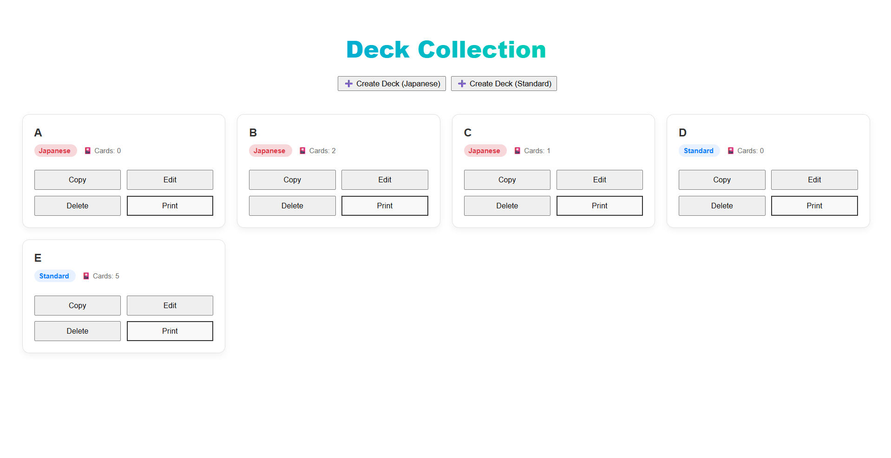
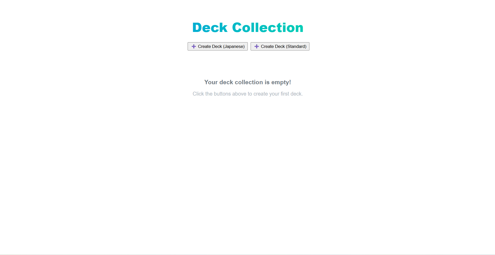
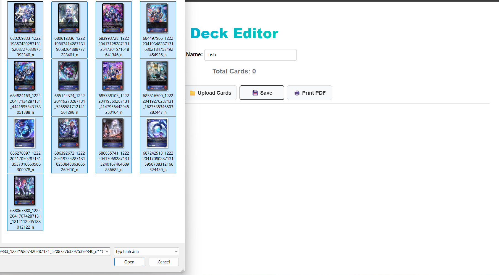
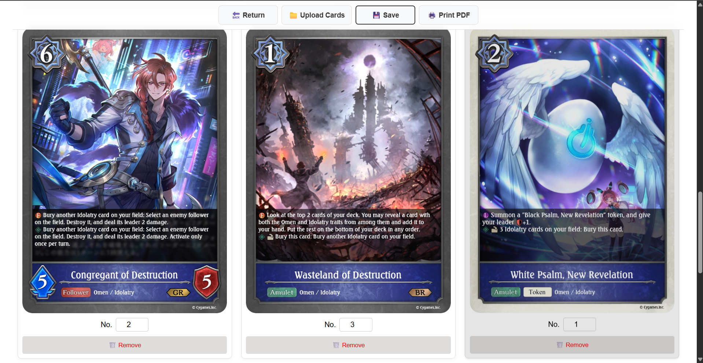
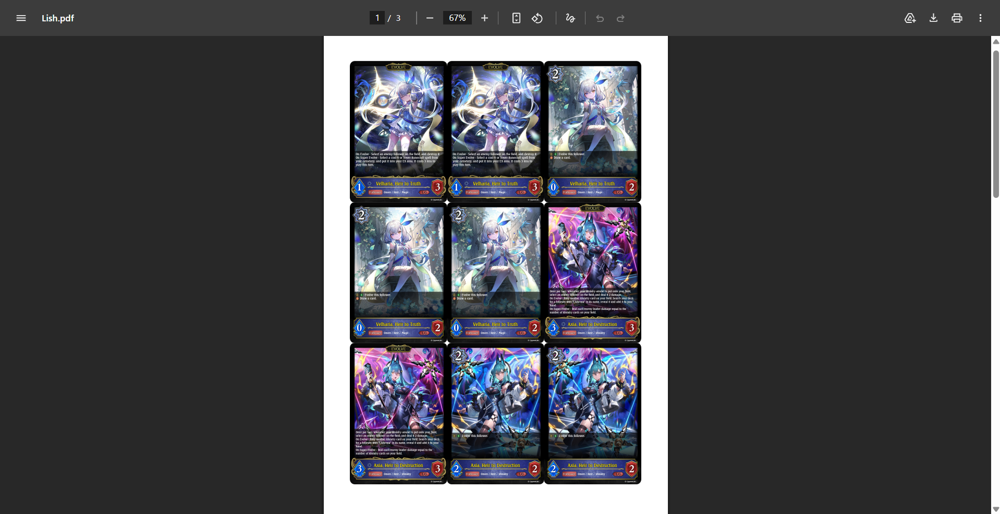

# TCG Card Print Maker 🎴

A high-performance web application designed for Trading Card Game (TCG) players to organize card images and generate print-ready PDF files with precision.

### ✨ Key Features
*   **Multiple Card Sizes:** Supports **Japanese size** (59x86mm) for games like *Cardfight!! Vanguard* and **Standard size** (63x88mm) for games like *Shadowverse EVOLVE*.
*   **Auto-Layout Engine:** Automatically arranges exactly 9 cards per A4 sheet with optimal margins for easy cutting.
*   **Persistent Storage:** Saves your decklists locally using **IndexedDB**,ensuring your data is safe even after a browser refresh.
*   **Efficient Management:** Seamlessly Copy,Edit,and Print decks directly from your personal collection.
*   **Privacy-Centric:** All image processing (Base64 conversion) is done client-side. Your images never leave your computer.

### 🛠 Tech Stack
*   **Frontend:** HTML5,CSS3,JavaScript (ES6+).
*   **PDF Engine:** **jsPDF** for high-quality,vector-based PDF generation.
*   **Database:** IndexedDB for robust local data persistence.

### 🚀 How to Use

1.  **Select Size:** Choose between Japanese or Standard size on the dashboard.
    

2.  **Upload:** Drag and drop or browse your card images (Bulk upload supported).
    

3.  **Configure:** Set the quantity for each card and give your deck a name.
    

4.  **Export:** Click "Print PDF" to save a ready-to-print file to your device.
    

### 📄 License
Distributed under the MIT License. See `LICENSE` for more information.